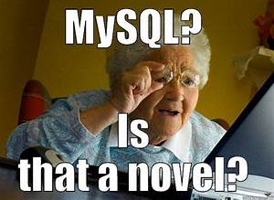

# Web Development Lab 1 - MySQL

A repository to store all the course content files for **'Web Development Lab 1 MySQL'**. It includes files like class notes, assignments, labs, etc. for the course.

---

## Instructor

- Jemi Choi

---

## What We Learn

In this class, we are taught about the concepts of MySQL database to be able to write database query scripts and also to figure out the ways to connect data between multiple tables.[^1]



_A programming meme for MySQL"_

> :memo: **Note:** This class is very important as we are dealing with the data storing component of the web.

[^note]: This class takes place online every Tuesday from 11:40 AM - 2:20 PM.

---

## Learning Resource
[W3School](https://www.w3schools.com/mysql/)

---

## Code Sample - C#

```sql
SELECT Customers.CustomerName, Orders.OrderID
FROM Customers
LEFT JOIN Orders ON Customers.CustomerID = Orders.CustomerID
ORDER BY Customers.CustomerName;
```

- SQL scripts
- Operators
- Aggregate functions and Groups
- Joins and aliases
- Pks and FKs
- Database design practice

[^1]: We have learned the above topics by now:
